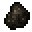

# Dokumentation of Gunpowder

### Usage

This mod include a alternative recipe for gunpowder.

### Drops

- Saltpeter() can drop from Sandstone.
- Sulfur() can drop from Netherrack.

### Recipes 

##### Gunpowder ()

<table style="border:1px solid black; border-collapse: collapse;">
    <tr style="border:1px solid black; border-collapse: collapse;">
        <td style="border:1px solid black; border-collapse: collapse;">&nbsp; &nbsp; &nbsp;</td>
        <td style="border:1px solid black; border-collapse: collapse;">&nbsp; &nbsp; &nbsp;</td>
        <td style="border:1px solid black; border-collapse: collapse;">&nbsp; &nbsp; &nbsp;</td>
    </tr>
    <tr style="border:1px solid black; border-collapse: collapse;">
        <td style="border:1px solid black; width:16px; height:16px">&nbsp;&nbsp;</td>
        <td style="border:1px solid black;">&nbsp;&nbsp;</td>
        <td>&nbsp;&nbsp;</td>
    </tr>
    <tr style="border:1px solid black; border-collapse: collapse;">
        <td style="border:1px solid black; border-collapse: collapse;">&nbsp; &nbsp; &nbsp;</td>
        <td style="border:1px solid black; border-collapse: collapse;">&nbsp; &nbsp; &nbsp;</td>
        <td style="border:1px solid black; border-collapse: collapse;">&nbsp; &nbsp; &nbsp;</td>
    </tr>
</table>

