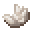

# Dokumentation of Vegetable Oil

### Usage

Vegetable Oil is a base item for recipes of some other vegan life items.
For example:
	- Vegetable oil ink (black/white)
	
### Drops

Sunflower Seeds () can drop from sunflowers.

### Recipes 

##### Vegetable oil ()

<table style="border:1px solid black; border-collapse: collapse;">
    <tr style="border:1px solid black; border-collapse: collapse;">
       <td style="border:1px solid black; border-collapse: collapse;">&nbsp; &nbsp; &nbsp;</td>
         <td>&nbsp;&nbsp;</td>
        <td style="border:1px solid black; border-collapse: collapse;">&nbsp; &nbsp; &nbsp;</td>
    </tr>
    <tr style="border:1px solid black; border-collapse: collapse;">
        <td style="border:1px solid black; border-collapse: collapse;">&nbsp; &nbsp; &nbsp;</td>
        <td>&nbsp;&nbsp;</td>
        <td style="border:1px solid black; border-collapse: collapse;">&nbsp; &nbsp; &nbsp;</td>
    </tr>
    <tr style="border:1px solid black; border-collapse: collapse;">
        <td style="border:1px solid black; border-collapse: collapse;">&nbsp; &nbsp; &nbsp;</td>
        <td style="border:1px solid black; border-collapse: collapse;">&nbsp; &nbsp; &nbsp;</td>
        <td style="border:1px solid black; border-collapse: collapse;">&nbsp; &nbsp; &nbsp;</td>
    </tr>
</table>

##### Vegetable wax ()

Burn Vegetable oil in a furnace.

##### Black Vegetable Oil Ink ()

Can be use instead of inc sak.

<table style="border:1px solid black; border-collapse: collapse;">
    <tr style="border:1px solid black; border-collapse: collapse;">
        <td style="border:1px solid black; border-collapse: collapse;">&nbsp; &nbsp; &nbsp;</td>
        <td style="border:1px solid black; border-collapse: collapse;">&nbsp; &nbsp; &nbsp;</td>
        <td style="border:1px solid black; border-collapse: collapse;">&nbsp; &nbsp; &nbsp;</td>
    </tr>
    <tr style="border:1px solid black; border-collapse: collapse;">
        <td style="border:1px solid black; width:16px; height:16px">&nbsp;&nbsp;</td>
        <td style="border:1px solid black;">&nbsp;&nbsp;</td>
        <td style="border:1px solid black; border-collapse: collapse;">&nbsp; &nbsp; &nbsp;</td>
    </tr>
    <tr style="border:1px solid black; border-collapse: collapse;">
         <td style="border:1px solid black;">&nbsp;&nbsp;</td>
        <td style="border:1px solid black;">&nbsp;&nbsp;</td>
       <td style="border:1px solid black; border-collapse: collapse;">&nbsp; &nbsp; &nbsp;</td>
    </tr>
</table>

##### White Vegetable Oil Ink ()

Can be use instead of white dye.

<table style="border:1px solid black; border-collapse: collapse;">
    <tr style="border:1px solid black; border-collapse: collapse;">
        <td style="border:1px solid black; border-collapse: collapse;">&nbsp; &nbsp; &nbsp;</td>
        <td style="border:1px solid black; border-collapse: collapse;">&nbsp; &nbsp; &nbsp;</td>
        <td style="border:1px solid black; border-collapse: collapse;">&nbsp; &nbsp; &nbsp;</td>
    </tr>
    <tr style="border:1px solid black; border-collapse: collapse;">
        <td style="border:1px solid black; width:16px; height:16px">&nbsp;&nbsp;</td>
        <td style="border:1px solid black;">&nbsp;&nbsp;</td>
        <td style="border:1px solid black; border-collapse: collapse;">&nbsp; &nbsp; &nbsp;</td>
    </tr>
    <tr style="border:1px solid black; border-collapse: collapse;">
         <td style="border:1px solid black;">&nbsp;&nbsp;</td>
        <td style="border:1px solid black;">&nbsp;&nbsp;</td>
       <td style="border:1px solid black; border-collapse: collapse;">&nbsp; &nbsp; &nbsp;</td>
    </tr>
</table>